# Part 1a

## Prelab
Before this lab, I updated my Arduino IDE and installed the CH340 driver. Additionally, I read through the SparkFun RedBoard Artemis Nano documentation to gain some familiarity with the functions of the board.

## Lab Tasks
### 1. Blink Test
I uploaded example code to make the LED on the Artemis blink.

    <iframe width="560" height="315" src="https://www.youtube.com/embed/iHwJw17ag6U" 
    frameborder="0" allowfullscreen></iframe>

### 2. Serial Monitor Test
I uploaded example code that enables me to type a message through the Serial Monitor to the Artemis, and the Artemis responds by printing my message back to me.

    <iframe width="560" height="315" src="https://www.youtube.com/embed/4grV-Z61xCI" 
    frameborder="0" allowfullscreen></iframe>

### 3. Temperature Sensor Test
I uploaded example code that allows the Artemis to print temperature readings. When I put my finger on the board, the raw temperature (output column 2) increases from 32000 to 33000.

    <iframe width="560" height="315" src="https://www.youtube.com/embed/xy1ozE7AGxQ" 
    frameborder="0" allowfullscreen></iframe>

### 4. Microphone Test 
I uploaded example code that allows the Artemis to print microphone frequency readings. When I blow on the board, the frequency readings spike to the 1000s.

    <iframe width="560" height="315" src="https://www.youtube.com/embed/qpQ__TOZpig" 
    frameborder="0" allowfullscreen></iframe>

## Reflection
This part of the lab taught me how to upload code to the Artemis board and how to read its output. Additionally, it showed me useful capabilities of the board and how to utilize them via the examples run.

# Part 1b

## Prelab
Before this lab, I first read about Bluetooth Low Energy (BLE), which is what I will be using to conenct to the Artemis from my computer. Essentially, BLE operates like a "community bulletin board", where connectors can either post information or read it.

I ran the provided Artemis codebase in order to get the MAC address of my board:

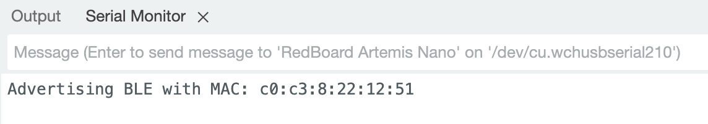

And I generated a UUID so that the connection from my computer to my Artemis will not have any outside interference:

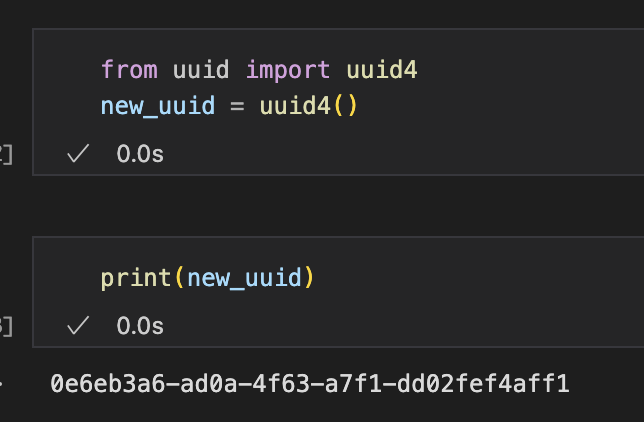

I used these 2 values to update their respective fields in the Artemis and computer codebases:

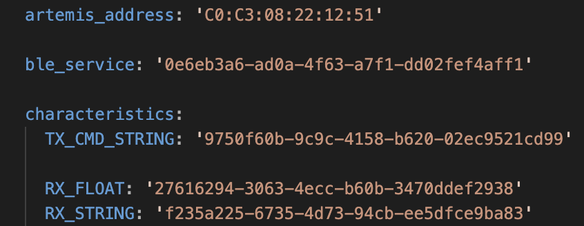
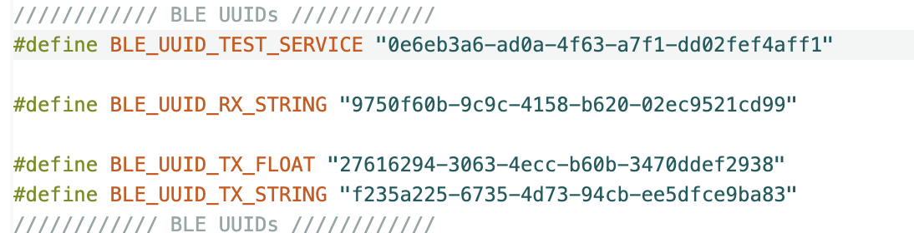

## Lab Tasks

Before I implemented tasks, I updated the enums in both the Artemis code and Python code to support the functionality added in later tasks.

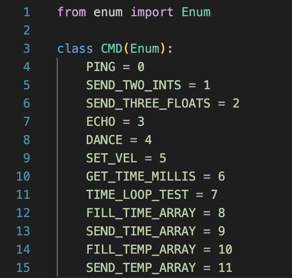
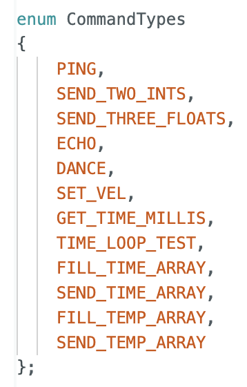

### Step 1: ECHO command
For this task, I had to send a "ECHO" command to the Artemis with a message for it to send back to me.

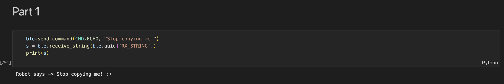
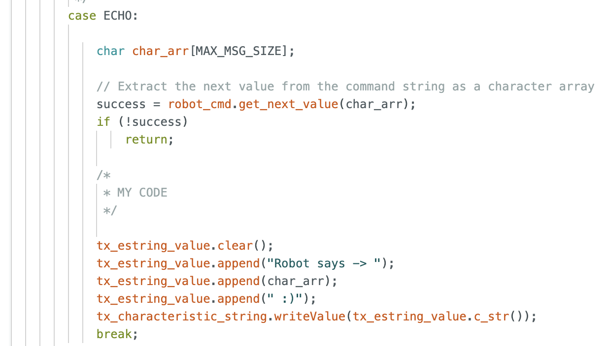

### Step 2: SEND_THREE_FLOATS command
For this task, I had to send a "SEND_THREE_FLOATS" command along with 3 floats for the Artemis to print into the Arduino Serial Monitor.

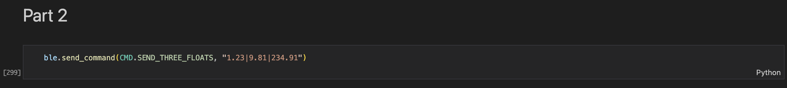
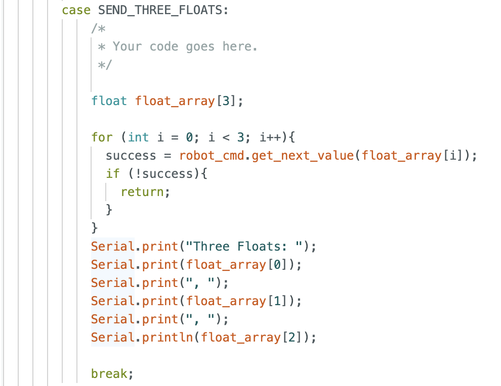

### Step 3: GET_TIME_MILLIS command
For this task, I had to send a "GET_TIME_MILLIS" command, which retrieves how many milliseconds have elapsed since the Artemis began its program.

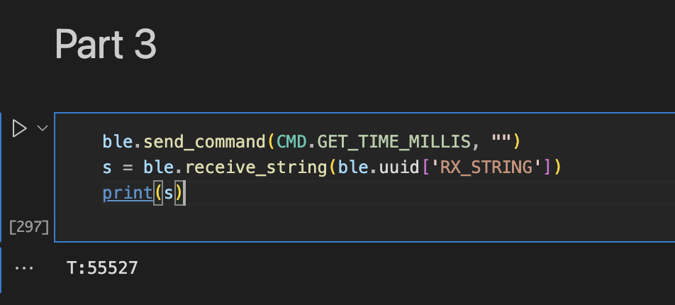
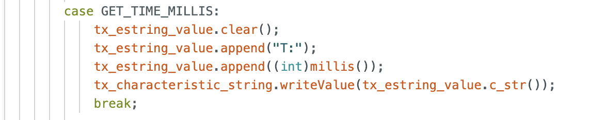

### Step 4: Setup Notification Handler

For this task, I looked ahead to later steps to see how the notification handler would be utilized. I implemented it so that it can return an array of time values (Steps 5 and 6) or return an array of temperature readings along with relative time values (Step 7).

### Step 5: Get Time Using Notification Handler
For this task, I implemented code so that the Artemis could return 100 time values to my computer, sending them one at a time when I call the "TIME_LOOP_TEST" command. Using these values, I determined that the transfer speed using this method is about 59 messages per second.

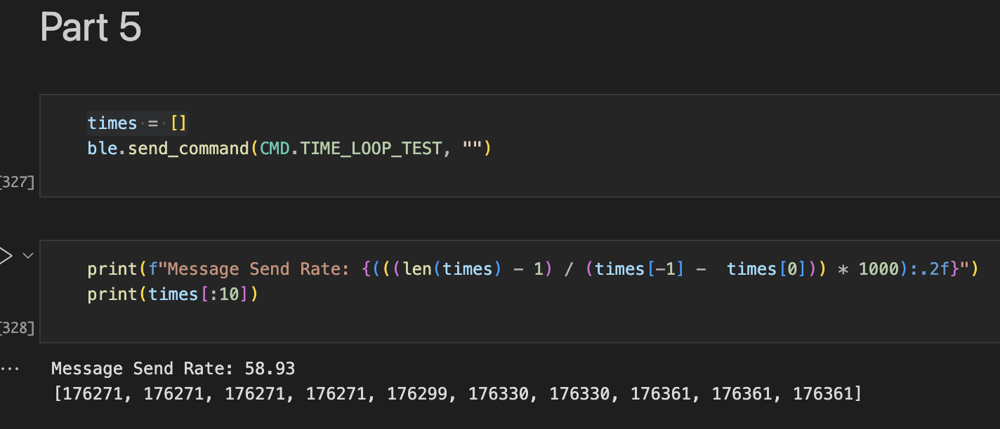
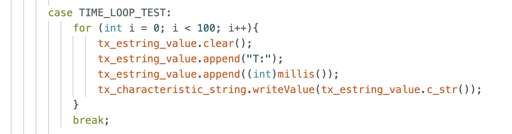

### Step 6: Get Time Array Using Notification Handler
For this task, instead of sending time values as they are read by the Artemis to my computer, the Artemis stores an array of 100 time values when I call the "FILL_TIME_ARRAY" command. It then sends them to my computer when I call the "SEND_TIME_ARRAY" command. Using this method, I am able to store about 50000 time values (+/- 15000 when testing with 100 time values) per second, which is a lot more than the previous method, but this does not account for the time it takes to send the data to my computer.

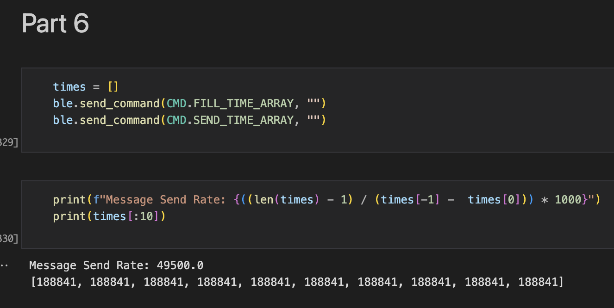
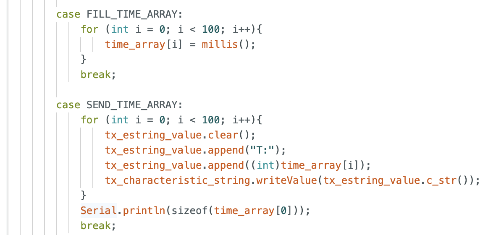

### Step 7: Get Concurrent Temperature & Time Arrays using Notification Handler
This task is similar to Step 6, but the Artemis is also recording and sending data from the temperature sensor, which is matched to a timestamp. To store the time and temperature data I call the command "FILL_TEMP_ARRAY", and to send the data to my computer I call the command "SEND_TEMP_ARRAY".
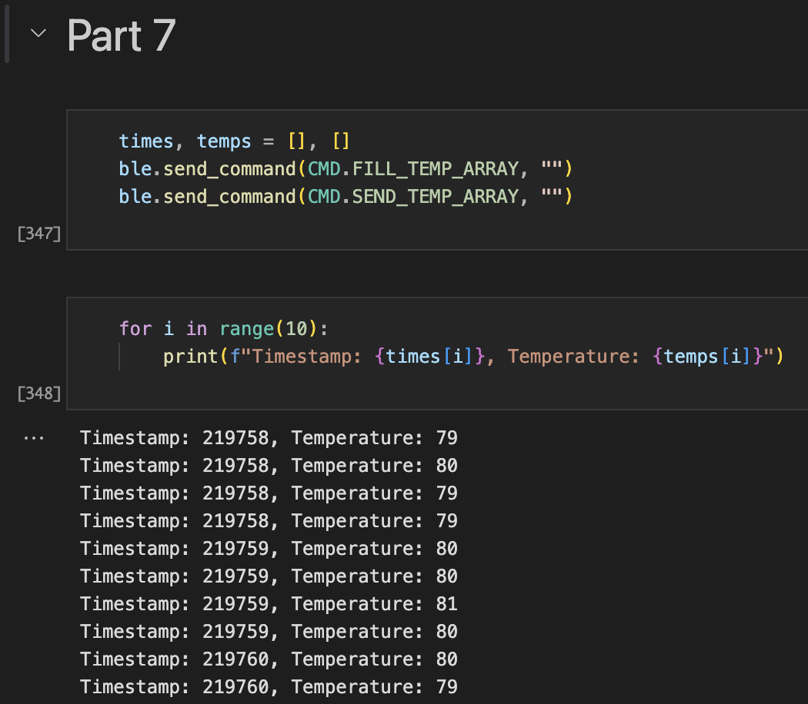
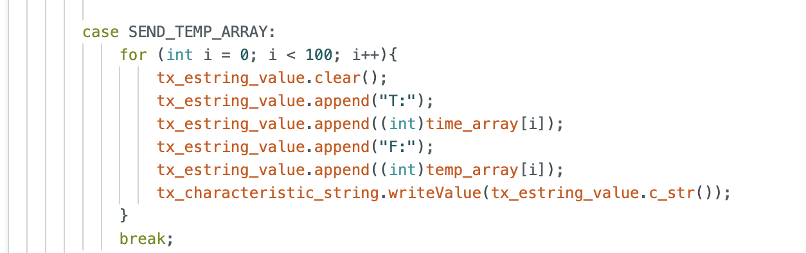

### Step 8: Compare Sending Individual Time Values (Step 5) vs Sending Time Arrays (Step 6)
While the polling rate of recording time arrays is much faster than sending singular values to my computer, that speed does not account for the time it takes to send the time arrays to my computer, so receiving the time arrays makes the second method about the same speed as the first. Despite this bottleneck, both methods still have their uses. 

The first method of recording individual time values can be useful if the computer needs to perform actions based on readings from the Artemis. One example is if the Artemis is powering a robot that tells the computer when it is in a certain location. These real-time updates will be better suited for the individual message sending. 

For the second method, this can be useful for debugging, like seeing if there is a lot of noise within the system, because of how fast the polling rate is. One thing to keep in mind is that the Artemis has a limited amount of memory, so data collection methods need to make efficient use of the board's memory. The size of the time values I am storing are 4 bytes each, and the board has 384 kB of RAM. Therefore, if the board saves a 4 byte value 50000 times a second, it will run out of memory in about 2 seconds.

## Reflection
This experiment helped me understand how to customize my interactions with the Artemis and customize them to meet my needs. It also taught me pros and cons of methods of storing and extracting information from the Artemis, which will be valuable in the long-term.