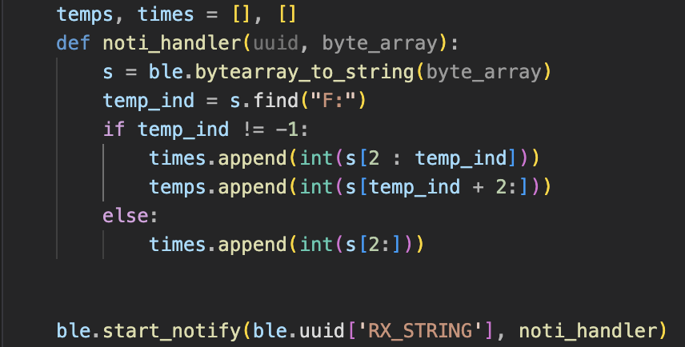

# Part 1a

## Prelab

## Lab Tasks

## Reflection

# Part 1b

## Prelab

## Lab Tasks

### Step 1: ECHO command

### Step 2: SEND_THREE_FLOATS command

### Step 3: GET_TIME_MILLIS command

### Step 4: Setup Notification Handler

For this step, I looked ahead to later steps to see how the notification handler would be utilized. I implemented it so that it can return an array of time values (Steps 5 and 6) or return an array of temperature readings along with relative time values (Step 7).

### Step 5: Get Time Using Notification Handler

### Step 6: Get Time Array Using Notification Handler

### Step 7: Get Concurrent Temperature & Time Arrays using Notification Handler

### Step 8: Compare Speed of Sending Individual Time Values (Step 5) vs Sending Time Arrays (Step 6)

## Reflection
This experiment helped me understand...