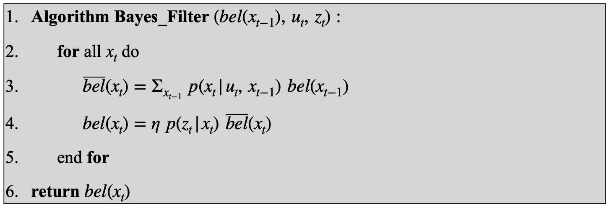
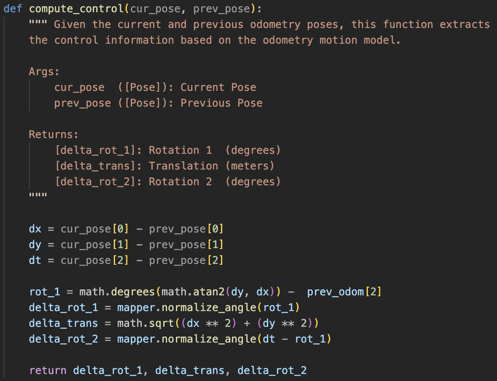
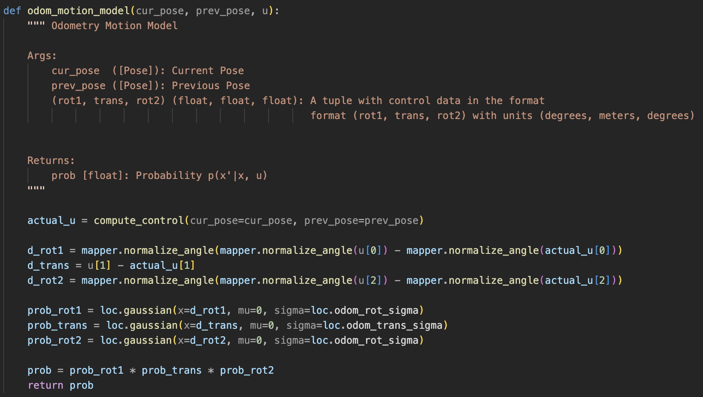
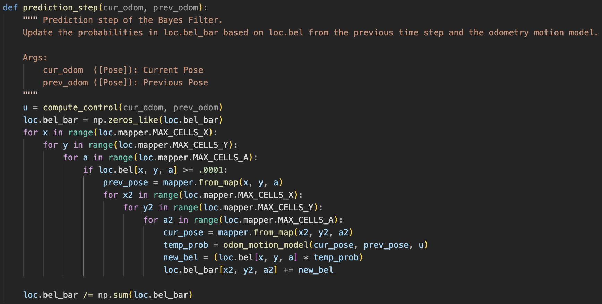
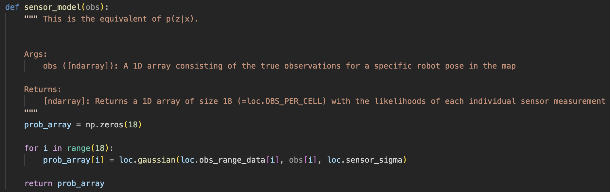
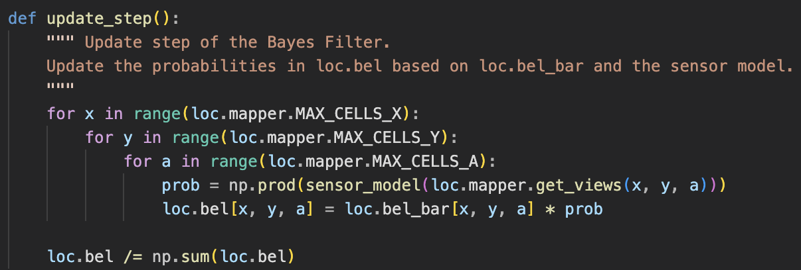

## Prelab

Before this lab, I setup my codebase and familiarized myself with how the Bayes filter works.
The Bayes Filter combines prior state belief, control input, and sensor data to map a probability
distribution of the current state of the robot.

  

## Lab Tasks

### Compute Control
First, I implemented the compute_control method which, given a previous and current position,
calculates the initial rotation, translation, and final rotation needed to travel from the previous
position to the current position.

  

### Odometry Motion Model
Second, I implemented the odom_motion_model method, which, given two positions and a control sequence, calculates the probability of the robot moving from the initial position to the next position. One thing to note is that angles have to be normalized (in this case to \[-180, 180\)) in this method and in future methods to prevent incorrect estimations (e.g. 0 degrees = 360 degrees but they differ by 360).

  

### Prediction Step
Third, I implemented the prediction_step method, which is the first step of the Bayes Filter algorithm. It uses odometry data and a previous belief distribution to calculate a new belief distribution of the robot's state. For efficiency, if the prior probability of a state is less than 0.0001, then it is excluded from updating the belief distribution because it would have little effect.

  

### Sensor Model
Fourth, I implemented the sensor_model method, which calculates the likelihood of 18 sensor readings from the robot given its position.

  

### Update Step
Lastly, I implemented the update_step method, which is the second step of the Bayes Filter and adjusts the belief distribution of the robot based on the sensor data.

  

### Result:

    <iframe width="560" height="315" src="https://www.youtube.com/embed/NTGNFXEt5oc" 
    frameborder="0" allowfullscreen></iframe>

## Acknowledgements

I referenced past students [Mikayla Lahr's](https://mikaylalahr.github.io/FastRobotsLabReports/startbootstrap-resume-master/dist/index.html#Lab%2010) and [Nila Narayan's](https://nila-n.github.io/Lab10.html) websites for implementing the methods.
