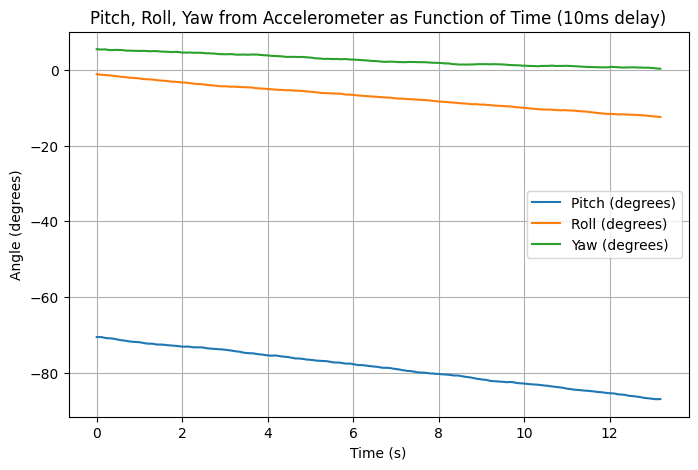

## Prelab
Before this lab, I read about the SparkFun 9DoF IMU Breakout board that we will be using in our robots. 
I also ensured that I had all of the correct drivers downloaded.
## Lab Tasks

### 1: IMU SETUP

Since I had already prepared the software side of IMU setup, all I had to do was connect it to the Artemis using the QUIIC connector:

I then ran the example code, which samples every sensor on the IMU and outputs the readings to the console, to ensure that everything was working properly:

    <iframe width="560" height="315" src="https://www.youtube.com/embed/5olZSfMXLpY" 
    frameborder="0" allowfullscreen></iframe>

I noticed that when the IMU is held with one axis facing towards the ground, the magnitude of the scaled acceleration is about 1000 in that axis. Additionally, the gyroscope reports displacement values from the previous position. I also noticed that every measurement has a bit of noise, even when the IMU is kept still.

I also read about the significance of AD0_VAL. It represents whether the ADR jumper is soldered closed (0) or not (1). Since it is not soldered closed, we want it to be 1.

### 2: Calculating Pitch and Roll from Accelerometer Data

The first thing I did was implement C and Python code to handle sending accelerometer data from the Artemis to my computer using BLE.

Note: I choose to sample 1200 times based on inspection; I saw that it gave me about 3 seconds of data, which was a nice sweet spot for testing efficiency and ensuring I have enough data to analyze.

I also needed to update my notification handler to receive IMU data via BLE to my computer:

Below are graphs of accelerometer data in various positions:

  
  

  
  

  

To try to reduce the noise present in the accelerometer, I performed a Fast Fourier Transform to analyze the data in the frequency domain. From this, I can determine a cutoff frequency for my accelerometer to make a low pass filter.

First, I generated some more accelerometer data, but this time I moved the IMU around while it was recording data so I could get a more accurate representation of how it will perform within the RC car.

  
  

I then performed the FFT:

  
  

Based on the graphs above, I decided that my cutoff frequency should be 10 Hz. Using this value, I calculated the value alpha to be used in the low pass filter:

  

Using this value within the Artemis code, I compared the raw angle measurement values to the ones created by the low pass filter:

  
  

  
  

From the above graphs, using the low pass filter reduces noise while the IMU is sitting still, and it is also able to match the raw sensor data while the IMU is moving.

### 3: Calculating Pitch, Roll, and Yaw Gyroscope Data

To use the IMU's gyroscope, I first implemented C and Python code to read from the gyroscope and send it from the Artemis to my computer via BLE:

To test the IMU's gyroscope, I first tested its capabilities while the IMU was lying flat:

  

Upon inspection, I noticed that the gyroscope's measurements for the angles drift even though the IMU is stationary. I believe that this is due to the effect of noise on dead reckoning calculations: since the angles are calculated by adding the product of angular velocity and a small time displacement, if the sensor is slightly off, then this error can propagate continuously. In the future, I can measure the stationary angular velocity readings and adjust them by constants to improve accuracy.

I also tried adding delays between gyroscope measurements to see if it would improve accuracy:

  
  

From the above graphs, neither the 10ms nor the 20ms delay improved the drift of the gyroscope's measurements. Therefore, I will stick with measuring gyroscope data as often as possible in order to get more consistent readings.

Next, I made a complimentary filter, combining the readings from the accelerometer (w/ Low Pass Filter) and the gyroscope to see if I could further reduce noise. I performed a 180 degree rotation about the y-axis (pitch) and plotted the resulting complimentary filter values.

The formula I used (from lecture slides):

And the code for the complimentary filter:

  
  

Below are the resulting pitch and roll graphs:

  
  

I set alpha to 0.3, which looks promising as it does not spike as high as the accelerometer readings, but it should probably be lowered so that the filter relies more on the gyroscope data, since the gyroscope values have less fluctuations.

### 4: Improving Data Sampling Rate

To improve data sampling, I first made sure to remove any print and debug statements.

I then made the following function to test if I could send 5 seconds of time data:

I removed the outer while loop from the getAGMT method to speed up data collection, too.

For data storage, I believe that all data should be stored as floats, except for time data, which should be stored as unsigned ints. On the Artemis Redboard Nano, both floats and ints take 4 bytes of space, and most of our sensor readings will not exceed +/- 180, so it is best to have the extra accuracy via the decimal places. Additionally, with 4 bytes we can store time values up to 2^32 - 1 milliseconds, which is more than enough for our needs.

### 5: Stunt!

    <iframe width="560" height="315" src="https://www.youtube.com/embed/4z1Af2QlYwI" 
    frameborder="0" allowfullscreen></iframe>

From playing around with the car, I noticed that it was very responsive to the controls I gave it: as soon as I pushed forward on the remote, it got to full speed quickly. I also noticed the same for breaking: the wheels would stop quickly, but momentum would keep the car moving, resulting in some cool flips. This will be something for me to keep in mind when thinking about what I want to make the car do.

## Reflection
My biggest takeaway from this lab is the power of combining sensors. By combining the noisy but accurate accelerometer with the precise gyroscope, I was able to get a cleaner reading of pitch and roll values. It showed me that combining inexpensive equipment can make up for the price difference with more pricey hardware.

