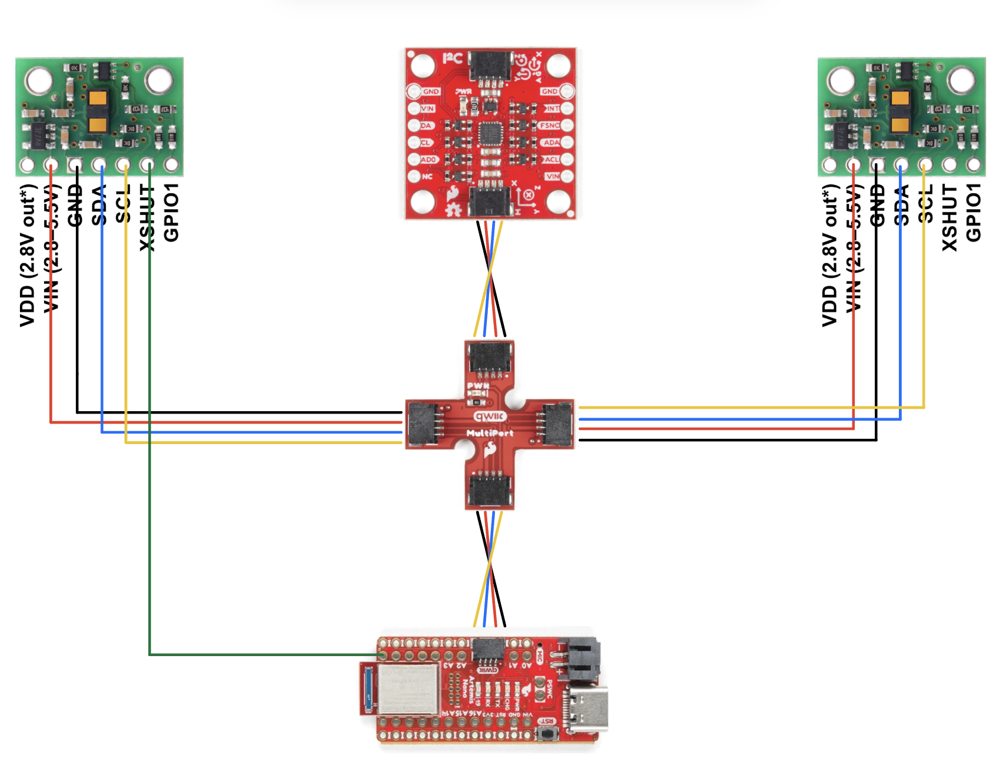

## Prelab

Before this lab, I skimmed the [datasheet](https://cdn.sparkfun.com/assets/8/9/9/a/6/VL53L0X_DS.pdf) and [manual](https://cdn.sparkfun.com/assets/e/1/8/4/e/VL53L1X_API.pdf) for the Time-of-Flight (ToF) sensor that we are using, the VL53L1X. From the datasheet, I found that the device address of the ToF sensor is 0x52, and the least significant but (LSB) is used to signal the direction which information is being sent. If the LSB is high (1), then my Artemis Redboard is writing information to the ToF sensor, but if it is low (0), then my Artemis is reading information from the ToF sensor. 

Additionally, since both ToF sensors have the same address, I will need to change one of their addresses so that the Artemis can interact with both of them. This can be accomplished by wiring the XSHUT pin from one of the ToF sensors to the Artemis, which enables the capability to put the ToF in standby mode, and while one ToF is in standby mode I can change the address of the other one.

Finally, I had to detemine how I would solder the Quiic cables to the ToF sensors. From looking at the [Quiic MultiPort connector schematic](https://cdn.sparkfun.com/assets/7/d/6/c/3/SparkFun_Qwiic_MultiPort_Schematic.pdf) and lining it up with my Quiic cables, I was able to determine that I need to solder the red wire to the ToF sensor's VIN, black to GND, blue to SDA, and yellow to SCL.

Below is a diagram of how I will wire together the two ToF sensors, the IMU, the Qwiic MultiPort connector, and the Artemis:

  

## Lab Tasks

### 1. Connect All Components to Artemis

My first task in the lab is to connect the battery, IMU, and ToF sensors to the Artemis. This was straighforward, as I had already planned how I was going to connect the Quiic cables to the ToF sensors and other connections.

  

For the purpose of testing ToF sensor functionality, I disconnect the battery, IMU, and second ToF sensor for the next step.

### 2. Discuss and Test Best ToF Sensor Mode

I first use the given example I2C code to ensure that I wired and soldered my ToF sensor properly:

  

From the output, I see that the address that was detected from my ToF sensor is 0x29, which does not match the ToF sensor's built-in address (0x52). However, since the LSB is solely used for data direction, it is omitted via a right shift, which gives the address we see, 0x29. Therefore, the output is expected.

### 3. Connect and Use Both ToF Sensors Simultaneously

### 4. Connect and Use Both ToF Sensors and IMU Simultaneously

## Reflection

From this lab, I learned about how the I2C protocol is used to allow communication of my Also, it was my first time soldering, which was a little intimidating at first, but became a lot easier after a few attempts.

## Acknowledgements

I referenced past students [Mikayla Lahr's](https://mikaylalahr.github.io/FastRobotsLabReports/startbootstrap-resume-master/dist/index.html#Lab%203) and [Nila Narayan's](https://mikaylalahr.github.io/FastRobotsLabReports/startbootstrap-resume-master/dist/index.html#Lab%203) code for connecting both ToF sensors at the same time.