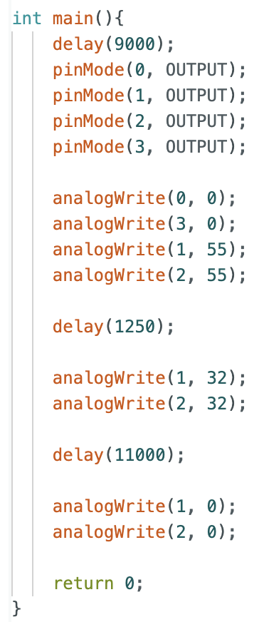

## Prelab
Before this lab, I mapped out how I want my motor drivers to be connected to my Artemis:

  

For controlling my motor drivers, I decided to use pins 0-3 because I want to have that side of the Artemis facing outward for ease of battery connection and Quiic connector connection.

I need to connect the motor drivers and the Artemis to separate batteries because the current draw for the motors is much higher than the Artemis, which could lead to damage to the Artemis if connected. Additionally, the current to the motors can fluctuate a lot, which can lead to disruptions in the Artemis's operations.

## Lab Tasks

### 1: Connect First Motor Driver

The first thing I did was wire one of the motor drivers to my Artemis. To make sure that it works as expected, I connected the VIN pin of the motor driver to an external voltage source and the output to an oscilloscope. Below is the code I used:

  

This code is designed to go through a range of PWM values and show that they are being output correctly:

    <iframe width="560" height="315" src="https://www.youtube.com/embed/7SnvEPIuzkg" 
    frameborder="0" allowfullscreen></iframe>

### 2: Connect 2nd Motor Driver & Mount to Car

Next, I wired the other motor driver to the Artemis and I mounted everything to the car. I decided to use tape for this lab so that I can easily debug issues as they arise.

  

While doing this, I ensured that the motor drivers and Artemis were successfully moving the car's wheels:

    <iframe width="560" height="315" src="https://www.youtube.com/embed/NiQJKHDMKBA" 
    frameborder="0" allowfullscreen></iframe>

### 3: Lower Limit PWM Values

Next, I had to determine what where the lowest PWM values that could keep the car going. I tested this for straight motion and also turning on an axis.

Below is the code I used for the straight test:

  

I found that the minimum PWM value was 32.

    <iframe width="560" height="315" src="https://www.youtube.com/embed/oQw6pdJP6aQ" 
    frameborder="0" allowfullscreen></iframe>

I performed a similar experiment, but for spinning on an axis. Below is my code:

  

I found that the minimum PWM value was 105.

    <iframe width="560" height="315" src="https://www.youtube.com/embed/KWa2APvpbFc" 
    frameborder="0" allowfullscreen></iframe>

### 4. Calibration

Next, I had to determine PWM values such that the car can move in a relatively straight line for small distances. Below is the code that I used:

  

And the result:

    <iframe width="560" height="315" src="https://www.youtube.com/embed/aS-xzQlS7Mo" 
    frameborder="0" allowfullscreen></iframe>

### 5. Open Loop Control

Finally, I demonstrated that the car can perform a small routine by itself. Below is the code that I used:

  

And the result:

    <iframe width="560" height="315" src="https://www.youtube.com/embed/xvfwmFH2qKQ" 
    frameborder="0" allowfullscreen></iframe>

## Reflection

My biggest takeaway from this lab was learning how much planning it takes to implement a system like this. This is the most hardware that I have integrated on my own, and I have learned a lot about how to plan out wire lengths, sensor placements, and more.

## Acknowledgements

I referenced past students [Mikayla Lahr's](https://mikaylalahr.github.io/FastRobotsLabReports/startbootstrap-resume-master/dist/index.html#Lab%203) and [Nila Narayan's](https://nila-n.github.io/Lab4.html) websites for Artemis conenctions and setting up code for the motor drivers.
