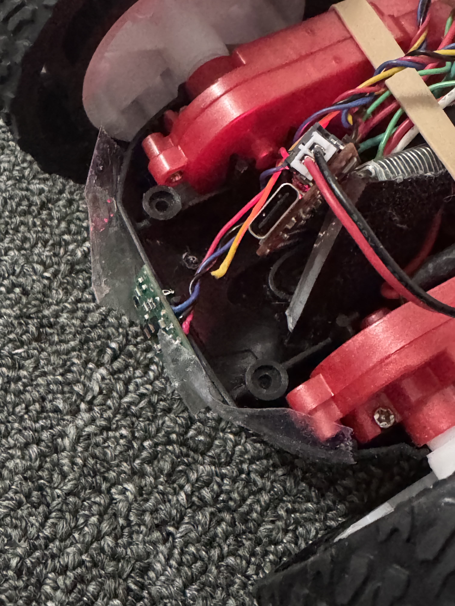
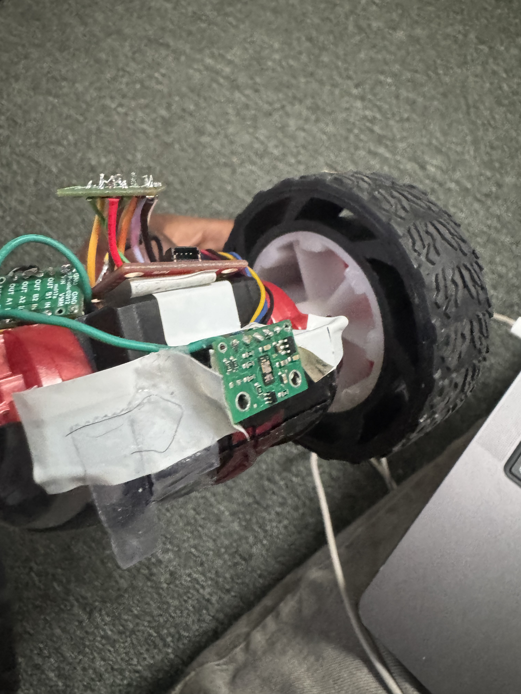

## Prelab

Before this lab, I familiarize myself with the components of PID control and how each term affects the output control that will be used by the robot. My plan was to begin with P control and change to PD if my car oscillates around the setpoint. Below is the algoritm I made to control my car:

## Lab Tasks

My strategy was to first see if only using a Kp term would provide good results.

Unfortunately, while completing this lab at home, my TOF sensors broke (one was purely a wiring issue):

  
  

This occurred between me finding good Kp and Kd values and beginning to record videos. I first found that Kp by itself was not robust enough (high values would overshoot target and run into wall and low values would be too slow or oscillate about the goal distace). Therefore I set Kd to 0.5, where it was not too slow but also would not run into the wall, and I tested small values of Kd, from 0.25 to 0.05, and I found that 0.1 led to quick convergence around the goal point.
