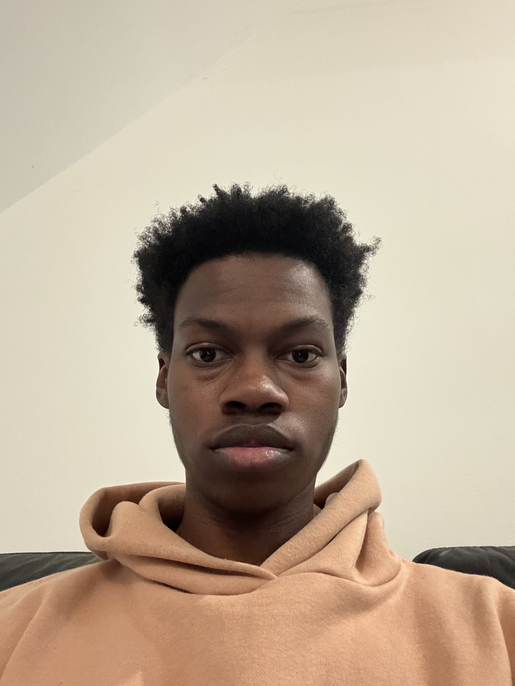

# About Me

    
    
Hello! My name is Josh Simpson, and I am a Computer Science major and Robotics minor at Cornell University. I am interested in Artificial Intelligence and Machine Learning, especially for physical systems. Outside of the classroom, I love to play chess, video games, and sports!

## Labs
- [Lab 1: The Artemis Board and Bluetooth](docs/pages/lab1.md)
- [Lab 2: IMU](docs/pages/lab2.md)
- [Lab 3: Time of Flight Sensors](docs/pages/lab3.md)
- [Lab 4: Motors and Open Loop Control](docs/pages/lab4.md)
- [Lab 5: Linear PID control and Linear interpolation](docs/pages/lab5.md)
- [Lab 6: Orientation Control](docs/pages/lab6.md)
- [Lab 7: Kalman Filter](docs/pages/lab7.md)